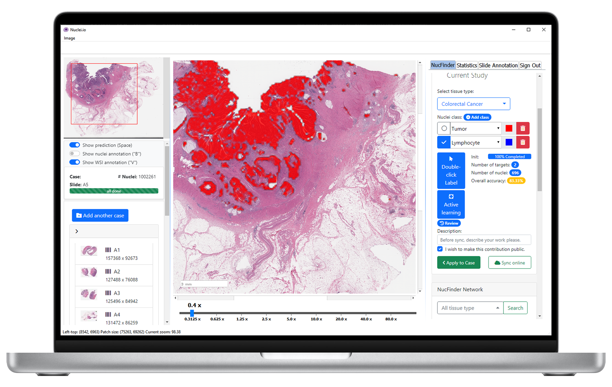
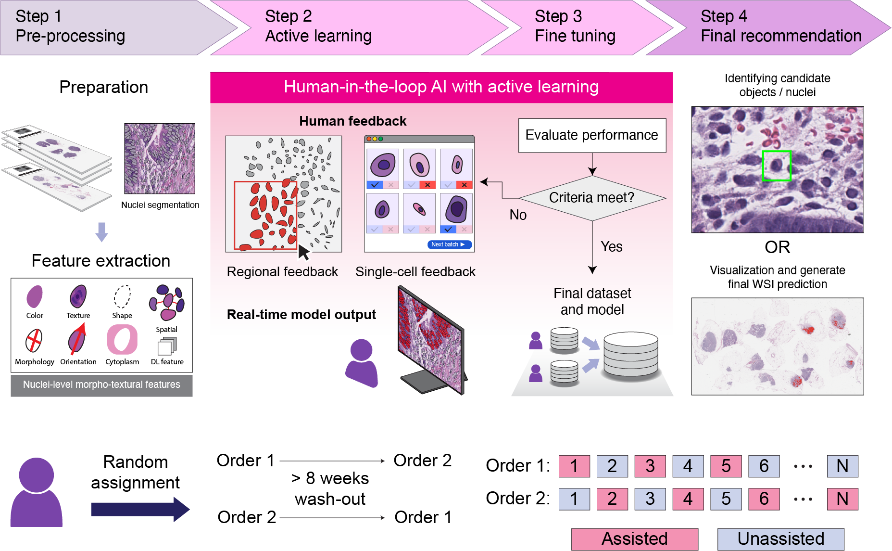
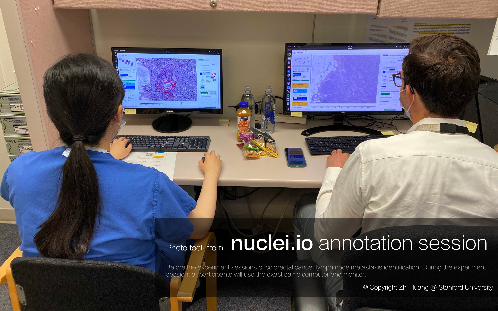

# nuclei.io: Human-in-the-loop active learning framework for pathology image analysis

## Introduction

<div style="display: flex; align-items: flex-start; justify-content: space-between;">

<div style="flex: 0 58%; margin-right: 10px;">
  <p>This software is an open-release under the study of <b>A pathologist–AI collaboration framework for enhancing diagnostic accuracies and efficiencies</b> published in <b>Nature Biomedical Engineering</b>.</p>

  <p>For the full information, please visit our homepage: https://huangzhii.github.io/nuclei-HAI/</p>

  <p>If you are a pathologist/user/developer who plan to use this software for annotating / analyzing whole slide pathology images, please follow the tutorial below.
</div>


<div style="flex: 0 38%;">
  
  <p>Install nuclei.io and run on your Macbook now!</p>
</div>

</div>


## Youtube tutorial
[](https://www.youtube.com/watch?v=0zsdcTNJteE)


## Initialization
We use Anaconda to manage the codes.

Note: If you do not have Anaconda yet, please follow this tutorial to install anaconda on your computer: https://docs.anaconda.com/free/anaconda/install/index.html

First thing first, clone our respository:
```bash
git clone https://github.com/huangzhii/nuclei.io.git
```

In this repository, we have some experimental data which are stored using `git-lfs`. If this is your first time using `git-lfs`, please follow this tutorial: https://docs.github.com/en/repositories/working-with-files/managing-large-files/installing-git-large-file-storage.
You may want to use `git lfs fetch` and `git lfs pull` to retrieve the actual files inside `experimental_data/`.


### Step 1. Initialize anaconda environment.
```bash
conda create -n nuclei.io python=3.10
conda activate nuclei.io
# Install dependencies
conda install openslide -c conda-forge # install openslide using conda.
```

### Step 2. Install the software.
Open the `nuclei.io` folder, and then install the software via:
```bash
cd nuclei.io/
pip install -e .
```


## Download example whole slide image.

### Step 3. Create directory and download `.svs` files from the Internet.
```bash
cd nuclei.io/
mkdir example_data;
cd example_data;
mkdir CMU_Aperio;
mkdir CMU_Aperio/CMU-1;
mkdir CMU_Aperio/CMU-2;
wget -O CMU_Aperio/CMU-1/CMU-1.svs https://openslide.cs.cmu.edu/download/openslide-testdata/Aperio/CMU-1.svs
wget -O CMU_Aperio/CMU-2/CMU-2.svs https://openslide.cs.cmu.edu/download/openslide-testdata/Aperio/CMU-2.svs
```

### Step 4. Run feature pre-calculation code for whole slide images.
Here, we simply run below python script to process the example images.
**Note: This feature pre-calculation should be better run on a Linux machine with GPU. We have not yet tried on Mac OS**.
```python
python feature_pre-calculation/main.py --slidepath "example_data/CMU_Aperio/CMU-1/CMU-1.svs" --stardist_dir "example_data/CMU_Aperio/CMU-1/stardist_results" --stage "all"
python feature_pre-calculation/main.py --slidepath "example_data/CMU_Aperio/CMU-2/CMU-2.svs" --stardist_dir "example_data/CMU_Aperio/CMU-2/stardist_results" --stage "all"
```

## Start using nuclei.io to annotate and visualize your data.
```bash
python software/main.py
```
Now, on the sidebar, click "Browse local", and open the folder `example_data/CMU_Aperio/CMU-1/`.

After that, you can follow our Youtube tutorial on how to annotate and analyze the whole slide image.


## Gallery

<div style="display: flex; flex-wrap: wrap; justify-content: space-between;">

<div style="flex: 0 48%; margin-bottom: 10px;">
  
  <p>nuclei.io user study diagram.</p>
</div>

<div style="flex: 0 48%; margin-bottom: 10px;">
  
  <p>nuclei.io experiment screenshot.</p>
</div>

<div style="flex: 0 48%; margin-bottom: 10px;">
  
  <p>nuclei.io for neuropathology.</p>
</div>

<div style="flex: 0 48%; margin-bottom: 10px;">
  
  <p>nuclei.io annotation session during CRC lymph node metastasis experiment.</p>
</div>
</div>


## Standing on the shoulders of giants

This software and research could not have been accomplished without being inspired by the ideas and codes from existing, exceptional visualization and feature calculation tools:

- [QuPath](https://qupath.github.io/)
- [SlideRunner](https://github.com/DeepMicroscopy/SlideRunner)
- [Qt for Python](https://doc.qt.io/qtforpython-6/)
- [OpenSlide](https://openslide.org/)
- [Stardist](https://github.com/stardist/stardist)
- [HistomicsTK](https://github.com/DigitalSlideArchive/HistomicsTK)